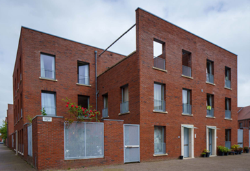
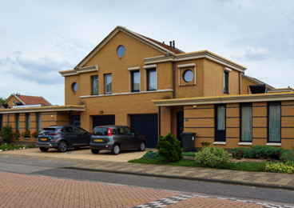

### Computer Vision for building type prediction
Computer vision is the fundamental driver of understanding and accessing information from images. Methods, such as image classification, semantic segmentation and object detection, are common practice using deep learning, such as Convolutional Neural Networks (CNN). For this study, a CNN is trained to detect residential building types, that are in line with the [TABULA WebTool](https://webtool.building-typology.eu/#bm) and 
residential types categories defined by [RVO](https://www.rvo.nl/onderwerpen/wetten-en-regels-gebouwen/voorbeeldwoningen-bestaande-bouw).

| Apartment House | Detached House | Semi Detached House | Terrace House |
|----------|----------|----------|----------|
|  |  |  |  |


### Convolutional neural network to detect building types
A supervised image classification model trains a convolutional neural network (CNN) to represent labelled images with similar embeddings. The supervised ML model learns to extract features from raw pixel data, where the same labelled images are learned to be represented in similar representations, as clusters in a feature space. Mathematically, consider a neural network of $L$ layers, where $x^0$ input feature vector (flatten layer) for the neural network (one sample), $x^L$ is the output vector of the neural network, where $x^{(L-1)}$ is often the output of the previous layer. $W^{(L)}$ the weight matrix, $b^{(L)}$ the bias term, $S_L$ the non-linear activation function. 


##### Formula for Fully Connected Layer Architecture
$x^{(L)}$ = $S_{\scriptstyle (L)}*({x^{(L-1)}}*W^{(L)}+b^{(L)})$

###### Transformation form
* ${x^{(L-1)}}*W^{(L)}$ = linear transformation
* $({x^{(L-1)}}*W^{(L)}+b^{(L)})$ = affine transformation
* $S_{\scriptstyle (L)}*({x^{(L-1)}}*W^{(L)}+b^{(L)})$ = non linear transformation

A CNN model for a multi-class classification task is developed to predict building types. The data source [BtImg](https://huggingface.co/datasets/juleKal/BuildingType) is used and contains four classes: Apartment House, Detached House, Semi-Detached House, and Terrace House. The preprocessing of the image data includes scaling pixel that normalises the intensity distribution over 255 pixels. The data is split in a ratio of 0.5/0.3/0.2 for training/validation/testing, respectively. The model is built using a 
multi-layer perceptron (MLP), a sequential model from TensorFlow Keras \cite{abadi2016tensorflow}, with three Conv2D layers including max pooling and the RELU activation function. A flatten layer decomposes the channel value to one vector, meaning it takes the tensor of the shape (height x width x rgb channels) and reshapes it to a one-dimensional vector. Finally, the Softmax function is used as an activation function in the final layer (dense). It takes a vector of raw scores (also called logits) and converts them into probabilities. The output probabilities of the Softmax function always sum up to 1. This way, the ML results can be interpreted as the likelihood of each class. The model compiler uses the cross-entropy as a loss function to measure how close the predicted 
distribution is to the true distribution (the one-hot encoded label). The model is evaluated on the validation data set, which measures how well it generalises to unseen data, and is assessed using precision, recall, and model accuracy. The model is trained on a GPU with TensorFlow 2.10.0, NVIDIA CUDA 11.2, and cuDNN 8.1. 

##### Installation guid
* Version: tensorflow_gpu-2.10.0 (pip install tensorflow-gpu==2.10.0) [link](https://www.tensorflow.org/install/pip)
* Python version: 3.7-3.10
* cuDNN: 8.1 [link](https://developer.nvidia.com/rdp/cudnn-archive)
* CUDA: 11.2 [link](https://developer.nvidia.com/cuda-11.2.0-download-archive?target_os=Windows&target_arch=x86_64)
In order to process the code using GPU with CUDA and cuDNN add the CUDA installations \bin, \libnvvp and \extras\CUPTI\lib64 to the environmental variables (C:\Program Files\NVIDIA GPU Computing Toolkit\CUDA\v11.8).
* Requirement.txt file includes all relevant packages that need to be installed via pip install. 
```terminal
python -m venv .venv
pip install -r requirements.txt
````

##### CNN.ipynb outline
> 1. Image Cleaning
>> 1.1 Remove dodgy images \
>> 1.2 Augment Images \
>> 1.3 Load Data
> 2. Preprocessing Data
>> 2.1 Scaling Data \
>> 2.2 Split Data 
>  3. Model
>> 3.1 Build Deep Learning Model \
>> 3.2 Train \
>> 3.3 Plot performance 
> Evaluate Performance
>> 4.1 Evaluation (Precision, Recall, Accuracy) \
>> 4.2 Test \
> Save the Model
>> 5.1 Save the model 

